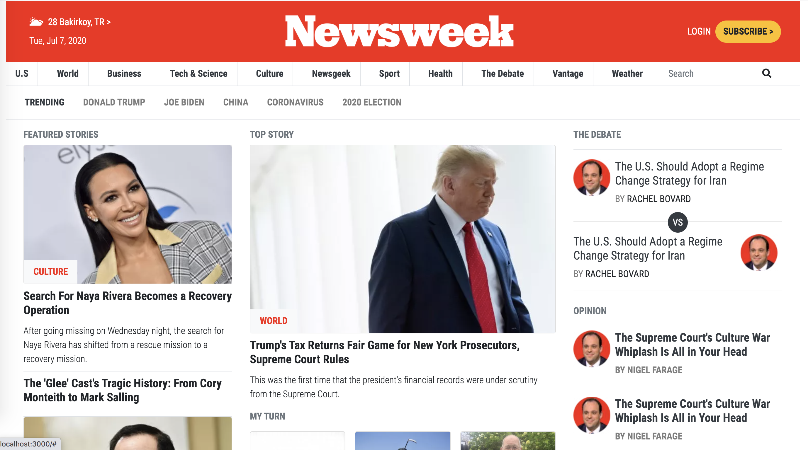

# Project Name

> Microverse School > 7. HTML & CSS3 > Using Bootstrap

This is the implementation of the newsweek.com frontend page by using Bootstrap.




## Built With

- HTML
- Bootstrap 4.5,
- CSS and Media Queries,

## Live Demo

[Live Demo Link](https://rawcdn.githack.com/RaminMammadzada/using-bootstrap/7891278b9428020bb4a1c5356b9095c6f1a2cbd1/index.html)


## Getting Started

**This is an example of how you may give instructions on setting up your project locally.**
**Modify this file to match your project, remove sections that don't apply. For example: delete the testing section if the currect project doesn't require testing.**


To get a local copy up and running follow these simple example steps.

### Usage

- ``` git clone https://github.com/RaminMammadzada/using-bootstrap.git ```
- Download Bootsrap-4.5.0-dist and font-awesome-4.7.0 libraries and locate it in assets/ folder.
- Then open the index.html file in your favorite browser.

## Authors

👤 **Ramin Mammadzada**

- Github: [@raminmammadzada](https://github.com/raminmammadzada)
- Twitter: [@raminmammadzada](https://twitter.com/raminmammadzada)
- Linkedin: [raminmammadzada](https://linkedin.com/raminmammadzada) 
- Email: [raminmammadzadaiu@gmail.com](mailto:raminmammadzadaiu@gmail.com?subject=[GitHub]%20Source%20Han%20Sans)

## 🤝 Contributing

Contributions, issues and feature requests are welcome!

Feel free to check the [issues page](issues/).

## Show your support

Give a ⭐️ if you like this project!


## 📝 License

This project is [MIT](lic.url) licensed.

